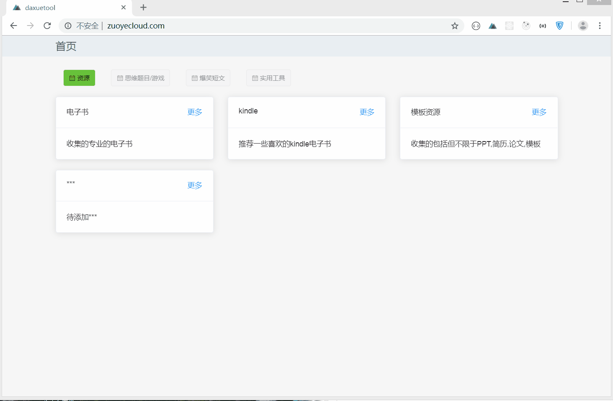
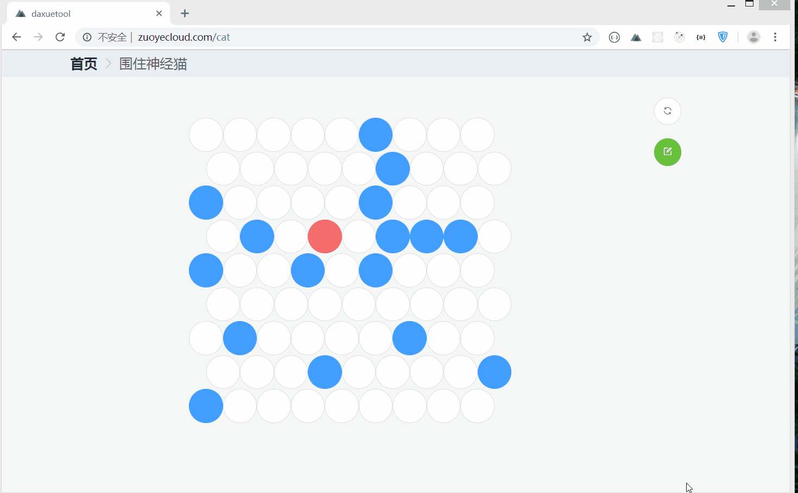
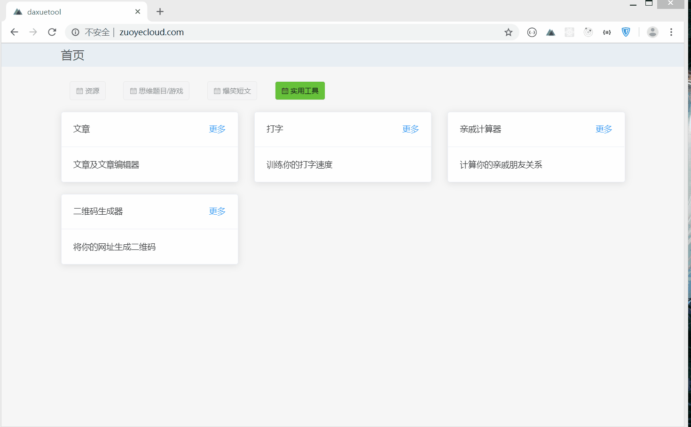

# 工具

> 一些工具的集合

介绍
------------------
>根据学习的nuxt搭建一个工具网站结合包含一些益智游戏和小工具。

技术说明
------------------
前端部分
-------------------
- [x] 电子书的搜索，下载，查看
- [x] 逻辑题目的查看，编辑，上传。
- [x] 扫雷游戏的实现
- [x] 数独的生成
- [x] 华容道的实现与解密
- [x] 木板华容道的实现与解密
- [x] 数字华容道的实现
- [x] 围住神经猫的实现
- [x] 竹竿游戏
- [x] 文章的标题展示，新增，修改，评论。
- [x] 通过上传文本打字练习
- [x] 计算不同亲戚之间的称呼
- [x] 二维码的生成与下载

技术栈
------------
- [x] nuxt
- [x] vue
- [x] element-ui
- [x] Express
- [x] Mongodb
- [x] Mongoose

项目运行效果
------------------
## 竹竿游戏
--

## 书籍展示

## 笑话列表

## 围住神经猫

## 上传文件

## 华容道及华容道解密

## 数字华容道

## 木板华容道

## 扫雷

## 二维码生成及下载

## 亲戚计算器

## 打字练习

